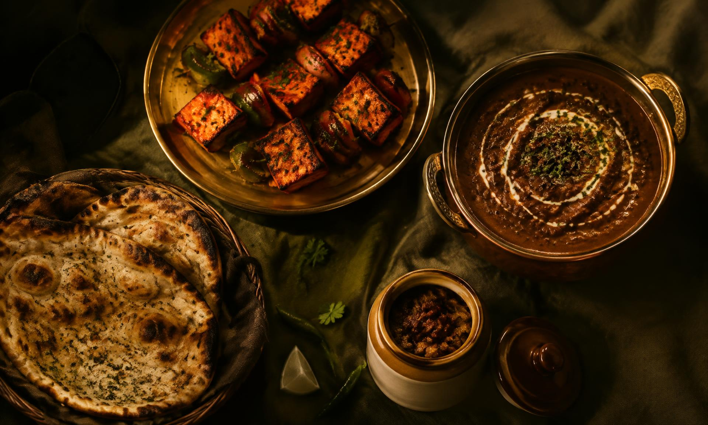
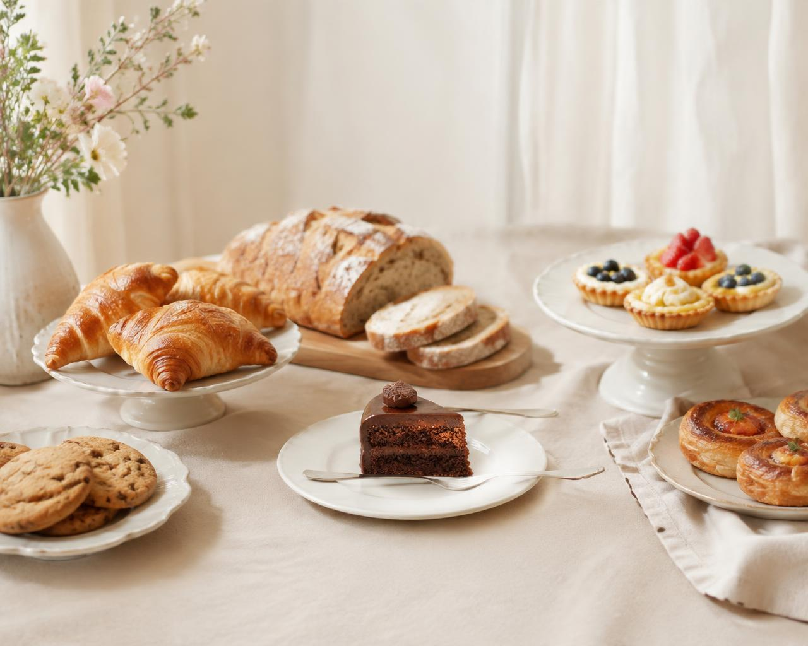
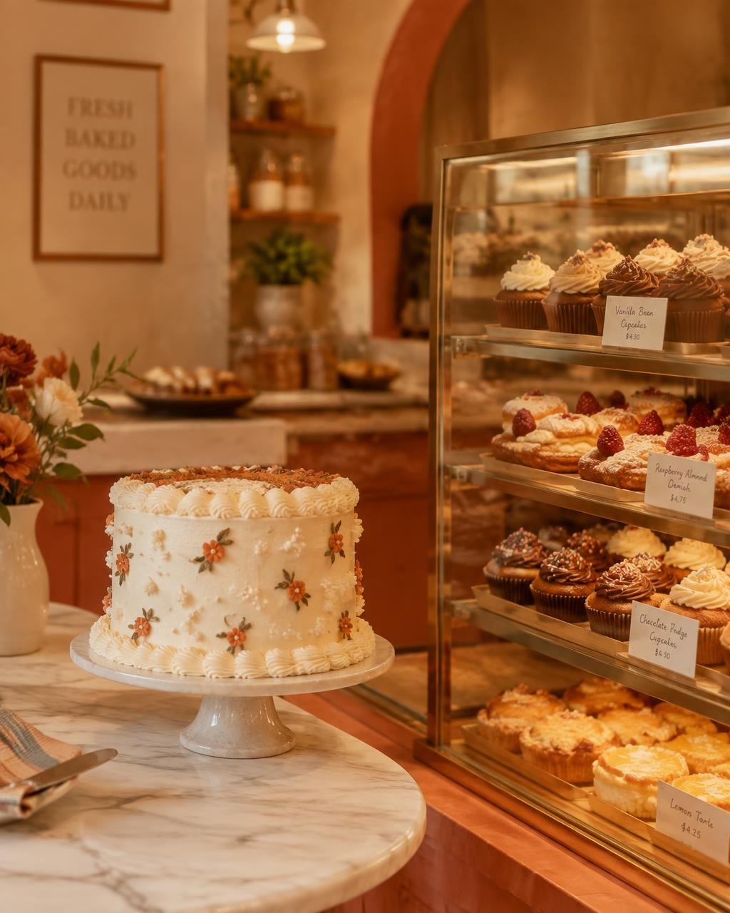
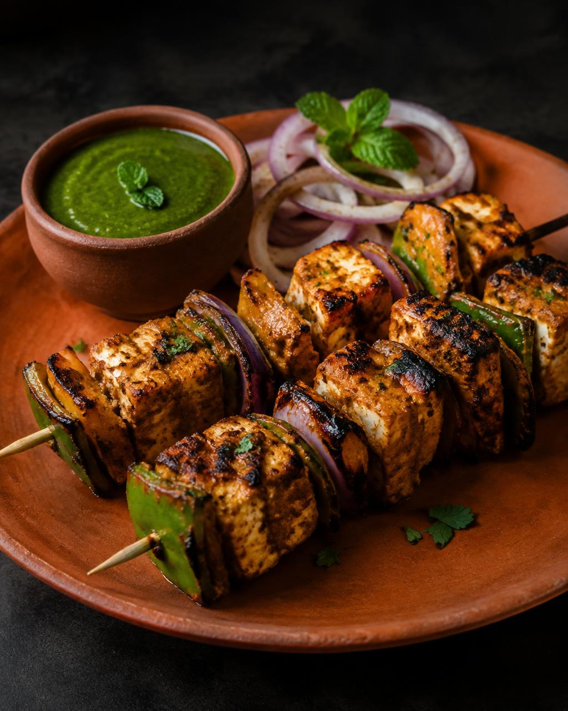
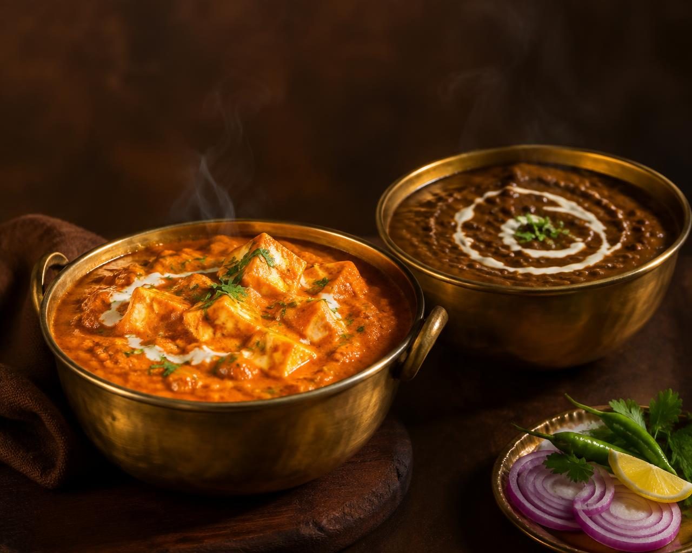
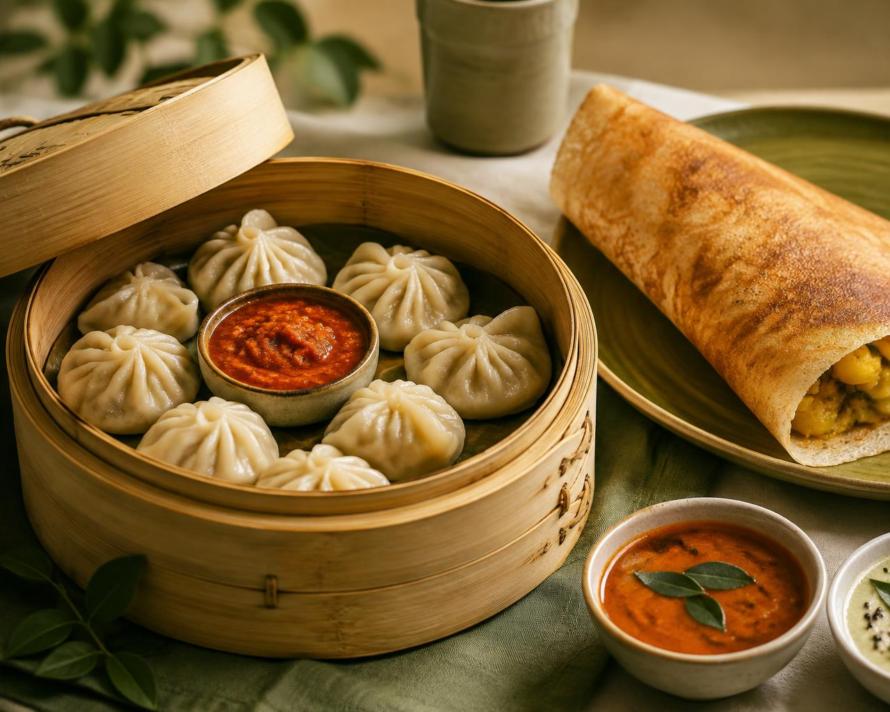
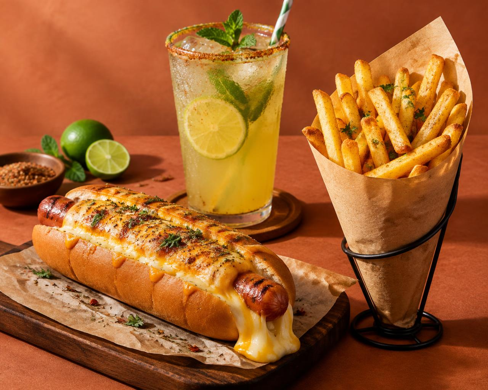
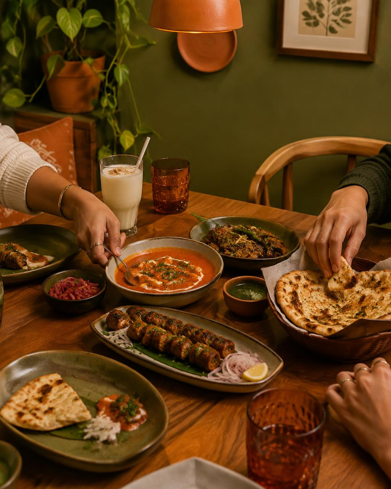
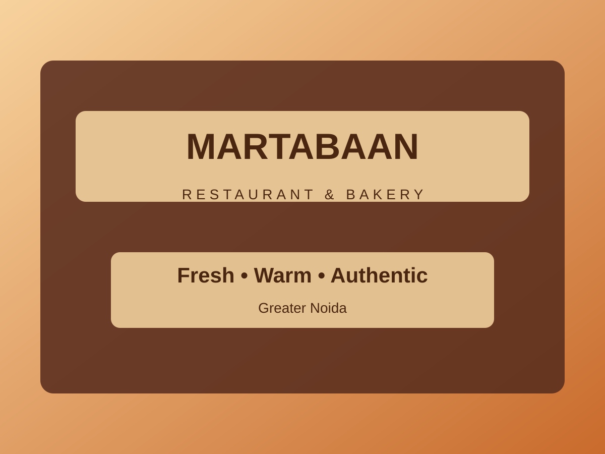
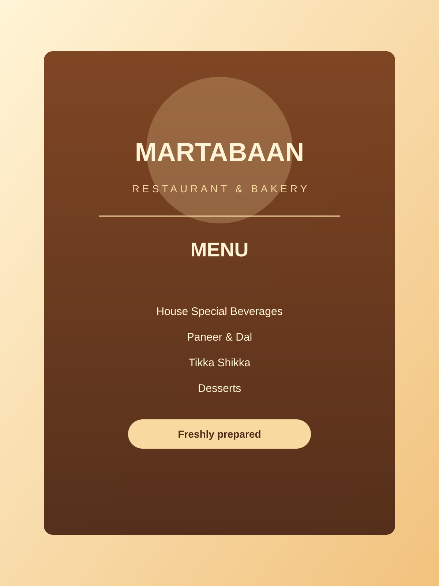

# 📸 Website Image Catalog & Visual Portfolio
**Martabaan Restaurant & Bakery (Greater Noida)**

---

> [!NOTE]
> **To the Buyer:** This document catalogs all the photography, banners, culinary highlights, and bakery imagery included in your website. You can review all website imagery below without launching the live web server.
>
> 💡 *Tip: You can also open the companion file [`WEBSITE_VISUAL_SHOWCASE.html`](file:///c:/Users/Dell/Downloads/pixel-perfect-main/WEBSITE_VISUAL_SHOWCASE.html) in any browser (Chrome, Edge, Safari) to browse these images in a luxury interactive presentation format with fullscreen zoom.*

---

## 1. Homepage Hero Banner

### **The Grand Welcome Feast**
* **File Name:** `pixel-perfect-main/src/assets/hero.jpg`
* **Placement on Website:** Full-screen top header banner
* **Visual Description:** An inviting, premium spread of North Indian dishes served family-style across the table. It features smoking tandoori naans, rich creamy dal makhani, shahi paneer, crisp accompaniments, and aromatic curries.
* **Role in Design:** Creates immediate visual appetite and warmth for the diner. Features an ambient zoom effect on load and subtle dark gradient shading to keep headline text and the *"Reserve a Table"* button easily readable.

---

## 2. Artisan Bakery & Patisserie

### **Fresh Oven Treats & Breads**
* **File Name:** `pixel-perfect-main/src/assets/bakery.jpg`
* **Placement on Website:** The Bakery Section (Homepage mid-section)
* **Visual Description:** A golden artisan spread of oven-fresh croissants, braided breads, chocolate tarts, and sliced confectionery.
* **Role in Design:** Positions Martabaan not just as a restaurant, but as a destination for artisan baked goods, breakfast treats, and takeaway sweets.

---

### **Celebration Cakes & Gourmet Confectionery**
* **File Name:** `pixel-perfect-main/src/assets/cakes.jpg`
* **Placement on Website:** Bakery Showcase & Visual Gallery Lightbox
* **Visual Description:** Designer multi-tier celebration cake showcased beside a luxury bakery glass cabinet.
* **Role in Design:** Directly promotes custom birthday cakes, anniversary cakes, and event catering inquiries.

---

## 3. Signature Culinary Highlights

### **Tandoor Se — Char-Grilled Paneer Tikka**
* **File Name:** `pixel-perfect-main/src/assets/paneer-tikka.jpg`
* **Placement on Website:** Tikka Shikka Category Highlight & Gallery
* **Visual Description:** Perfectly char-grilled cottage cheese cubes marinated in rich Indian tandoori spices, garnished with coriander and onion rings, served with chilled mint chutney.
* **Role in Design:** Represents the starter and tandoor menu section.

---

### **Paneer & Dal — Royal Curries & Dal Bukhara**
* **File Name:** `pixel-perfect-main/src/assets/curries.jpg`
* **Placement on Website:** Main Course Section & Gallery
* **Visual Description:** Classic rich North Indian gravies and dal makhani garnished with fresh cream and coriander in traditional serving bowls.
* **Role in Design:** Represents Martabaan's signature main course curries (Dal Makhani, Dal Bukhara, Highway Butter Masala).

---

### **Oriental Dimsums & Street Treats**
* **File Name:** `pixel-perfect-main/src/assets/momos-dosa.jpg`
* **Placement on Website:** Oriental Delights & Evening Snacks
* **Visual Description:** Freshly steamed dumplings/momos with spicy red dip and crisp South Indian specialties.
* **Role in Design:** Showcases menu diversity for quick evening casual dining.

---

### **Cafe Casuals — Loaded Bites & Golden Fries**
* **File Name:** `pixel-perfect-main/src/assets/hotdog-fries.jpg`
* **Placement on Website:** Cafe & Casual Bites Gallery
* **Visual Description:** Loaded cheese bites, crispy golden french fries, and cool drinks.
* **Role in Design:** Attracts younger crowds, students, and casual snack diners.

---

## 4. Restaurant Ambience & Dining Space

### **Warm Moments — Interior Dining Hall**
* **File Name:** `pixel-perfect-main/src/assets/dining.jpg`
* **Placement on Website:** "Our Story" Section & Gallery
* **Visual Description:** A welcoming, warmly lit dining room with comfortable table arrangements and friends sharing dishes.
* **Role in Design:** Communicates a hospitable, family-friendly ambience for dine-in celebrations and casual dinners.

---

### **Martabaan Storefront & Physical Location**
* **File Name:** `pixel-perfect-main/src/assets/restaurant-placeholder.svg`
* **Placement on Website:** Contact & Location section
* **Visual Description:** Stylized identity badge highlighting *"Martabaan Restaurant & Bakery — Fresh • Warm • Authentic — Greater Noida"*.
* **Role in Design:** Acts as the visual storefront anchor next to the Google Maps embed and physical address details.

---

## 5. Interactive Menu Cards System

### **Digital Menu Card Lightbox**
* **File Name:** `pixel-perfect-main/src/assets/menu-placeholder.svg`
* **Placement on Website:** Interactive Menu Cards Grid
* **Visual Description:** Standard high-definition template representing the 10 printed menu categories (Beverages, Soups, Tikka, Chaap, Paneer & Dal, Vegetables, Gravy Chaap, Biryani, Oriental, Desserts).
* **Role in Design:** Clicking any of the 10 menu cards opens a full-screen interactive lightbox viewer with keyboard arrow navigation and mobile swipe controls.

---

## 6. Image Specifications & Asset Summary

| Asset Name | Website Placement | Recommended Format | Purpose |
| :--- | :--- | :--- | :--- |
| `hero.jpg` | Top Hero Header Banner | Landscape (1920x1152) | First impression welcome spread |
| `bakery.jpg` | The Bakery Feature | Landscape (1280x1024) | Artisan bakery counter promotion |
| `cakes.jpg` | Bakery Showcase / Desserts | Portrait/Square (1024x1280) | Custom cakes & celebration orders |
| `paneer-tikka.jpg` | Tikka Shikka Menu & Gallery | Portrait/Square (1024x1280) | Tandoor starters showcase |
| `curries.jpg` | Main Course Menu & Gallery | Portrait/Square (1024x1280) | Signature handi curries & dals |
| `dining.jpg` | "Our Story" & Gallery | Portrait (1024x1280) | Restaurant dining ambience |
| `momos-dosa.jpg` | Oriental Menu & Gallery | Landscape (1280x1024) | Snacks & quick bites showcase |
| `hotdog-fries.jpg` | Cafe Delights & Gallery | Landscape (1280x1024) | Fast casual food appeal |
| `restaurant-placeholder.svg` | Storefront & Location | Vector SVG (1200x900) | Location badge & brand identity |
| `menu-placeholder.svg` | Menu Cards Modal Viewer | Vector SVG (1357x1920) | Digital interactive menu card reader |

---
*Prepared exclusively for Martabaan Restaurant & Bakery.*
